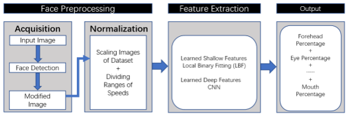
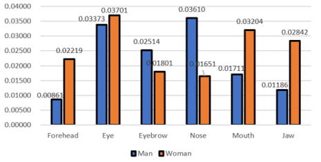

## **The Importance Distribution of Drivers’ Facial Expressions Varies over Time!**

​                                                                                                                      ——Accepted by AutomotiveUI '2021 WIP

#### Motivation

------

Facial Expressions are valuable data sources for advanced Human-Vehicle-Interaction designs. However, existing works always consider the whole facial expressions as input, which restricts the design space for detailed optimizations. To this end, we leverage Local Binary Fitting, a novel mechanism for selecting representative feature points from facial images on the fly, for our characterizations. Our characterizations reveal that, among six major components of facial feature points, there are significant variations of correlations with a certain vehicle status (i.e. Vehicle Speed), in terms of (1) the time spots during the driving procedure; and (2) the gender of the drivers.

#### Introduction

------

Nowadays, the whole facial expressions are considered as input for Human-Vehicle Interaction designs, which restricts the design space for detailed optimizations. Our goal is to justify the hypothesis that facial expressions can exhibit significant variations during the driving procedure. Our works can serve as a starting point to deal with adaptive and personalized Human-Vehicle Interaction designs in the future.

#### Procedure

------

**1. Preprocessing of Facial Expressions**

Acquisition & Normalization: Face Mesh is used to locate and intercept the whole facial expressions from input images. The located region is then normalized into the same dimension.

**2. Feature Extraction**

In the shallow layer of this model, the Local Binary Fitting is adopted to realize Normalized Pixel Difference. In the deep layer, CNN is utilized to group all feature points into 6 preset categories (forehead, eyes, eyebrows, nose, mouth and jaw).

**3. Output**

Each category feature points are unified through linear regression and the final feature points of each type is obtained.

#### Experiment Results

------

